# Influxdb alarms dashboarding with Notifier

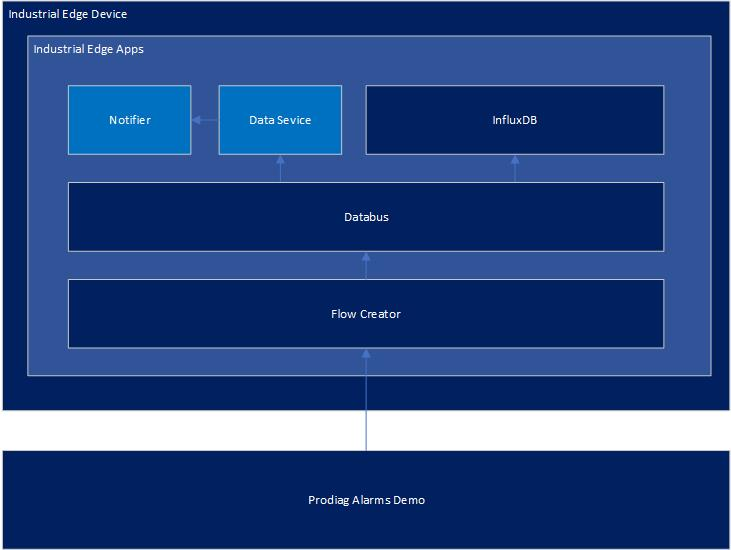

# 1. Setting up the Prodiag Alarms Demo

URL: [https://support.industry.siemens.com/cs/document/109740151/machine-and-plant-diagnostics-with-prodiag?dti=0&lc=en-AT](https://support.industry.siemens.com/cs/document/109740151/machine-and-plant-diagnostics-with-prodiag?dti=0&lc=en-AT)

Download and run on TIA portal. Then install to your PLC and HMI

Hardware setup is as follows:

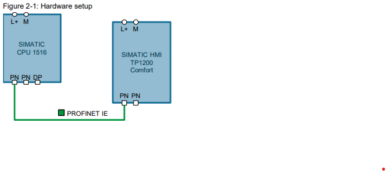

Allow OPCUA and Alarms and conditions

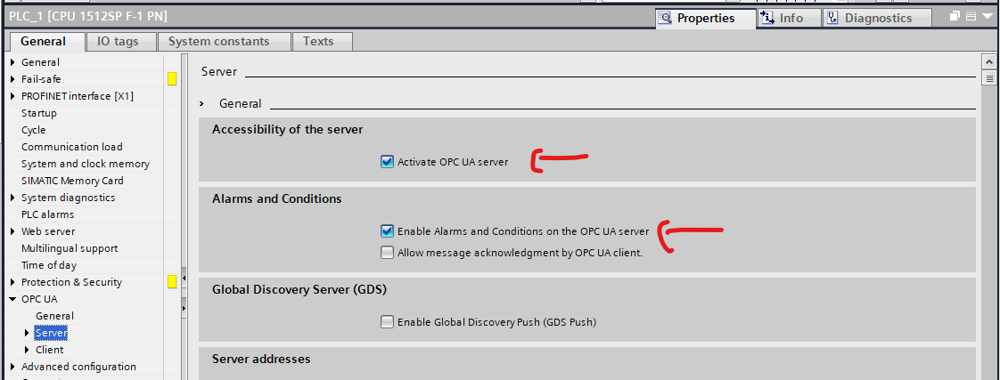

# 2. Installing the apps

## 2.1 Flow Creator

Install flow creator to your edge device

## 2.2 Databus

Install databus to your edge device

## 2.3 Data Service

Install dataservice to your edge device

## 2.4 Influxdb

Install Influxdb with the [Industrial edge publisher](https://support.industry.siemens.com/cs/document/109814441) and deploy the influxdb to the edge managment with the following [docker-compose.yml](./influxdb/docker-compose.yml) file. After that install the influxdb app to your edge device.

###### *use the [hello-world](https://github.com/industrial-edge/hello-world/blob/main/docs/installation.md) as an example. But use the [influxdb](./influxdb/) folder instead of hello world. With the reverse proxy you can use port 8086 instead of port 80.

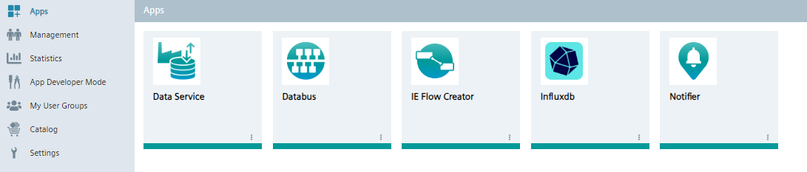

# 3. Setting up the apps

## 3.1 Databus

Do the same as the [S7 Connector Data Handling Getting Started](https://github.com/industrial-edge/S7-Connector-data-handling-getting-started/blob/main/docs/Installation.md) and fill in the settings as follows

Topic: ie/#

user: edge

password: **** (edge)

Permission: Publish and subscribe
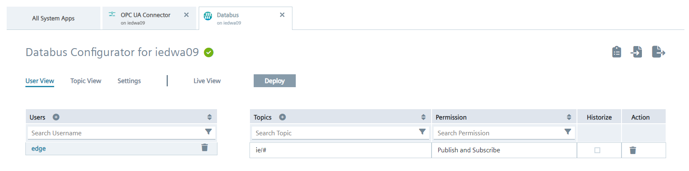

Click on add and deploy to your edge device.

# 3.2 Data Service

Just leave this as it is.

# 3.3 influxdb

open the App:

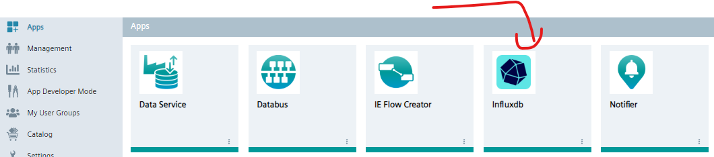

Click get started

* Fill in username and password as needed (username: edgeuser, password: edgeuser for example)
* Fill in organization (industrialedge for example) (this one is used in the infludb node in flowcreator)
* Fill in bucket (alarmsdemo for example) (this one is used in the infludb node in flowcreator)

and save

then a API token will be shown. copy this somewere (for example to the the apitoken.txt file)
next click on quick start.

and you are done.

# 3.4 Flow Creator

open the app

go to the palette

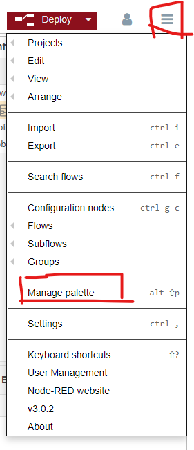

and install node-red-contrib-influxdb

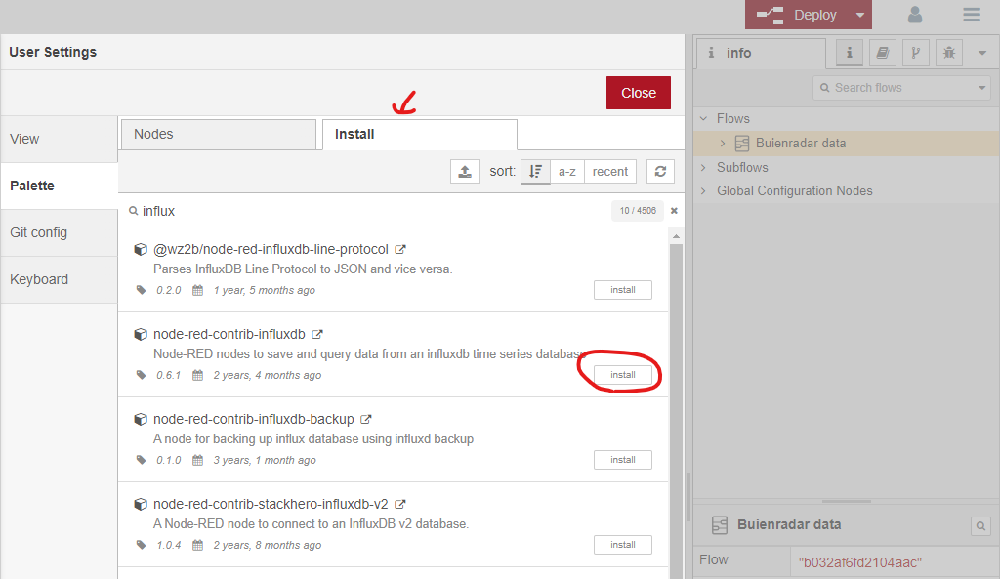

after that import the data from the  [flows.json](./flowcreator/flows.json) file

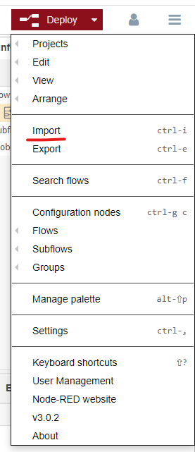

copy data from file and paste or import from file

go to the OPC UA Client node and set the correct endpoint. you need to connect it to the Prodiag PLC

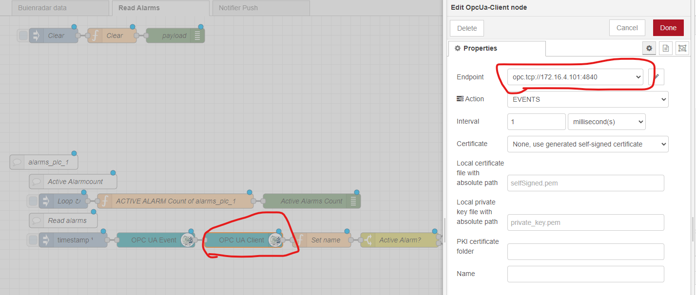

go to one of the MQTT nodes and set the security for from the databus. this was username: edge, password: edge. now it should be connected once you deploy

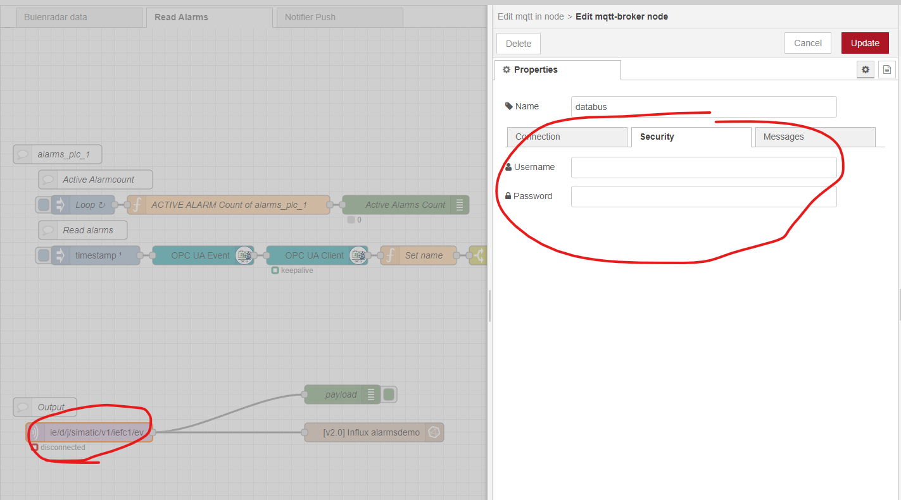

go to the influx node and put in the token from influxdb

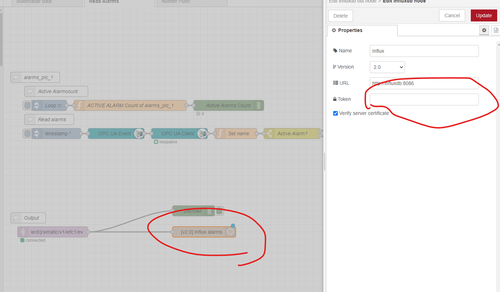

go to the Notifier push tab on the top of your screen and then select the HTTP Request nodes fill in username and password of your edge device (email and password)

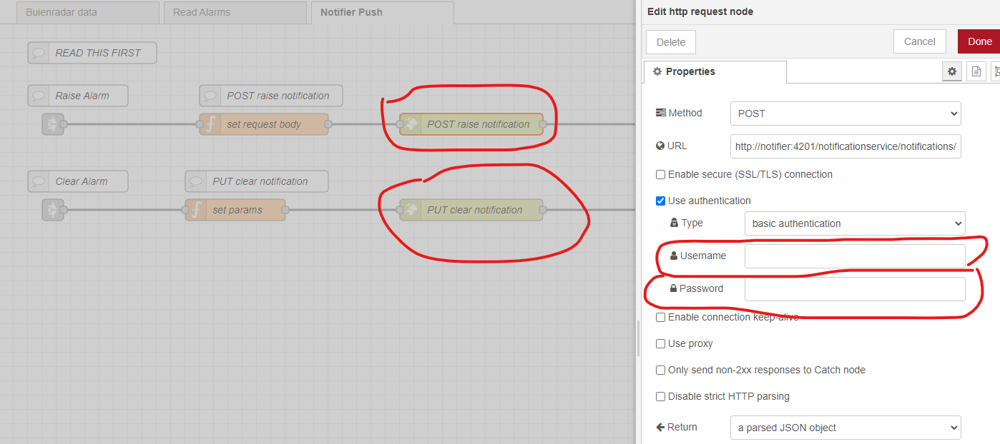

# 4. display some data

## 4.1 Generate alarms

Go to your Prodiag Touchpanel and generate some alarms

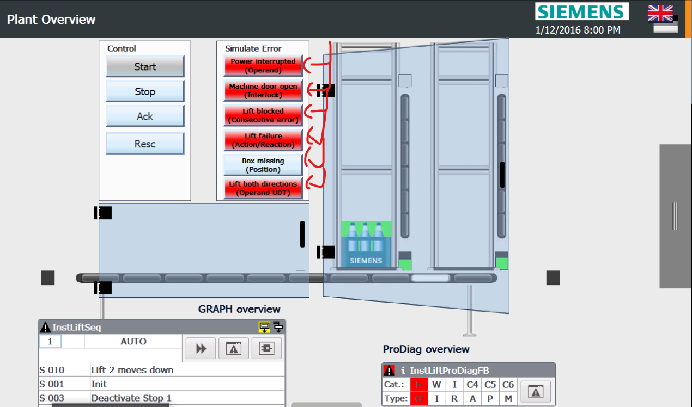

Go to notifier and you should see the alarms

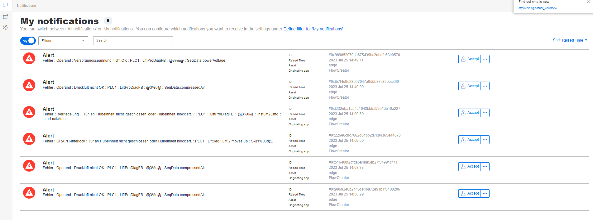

Go to influxdb and the alarms should also be here

go to Data Explorer > From alarmsdemo > filter alarms > filter value.
View raw data on and aggregation on last

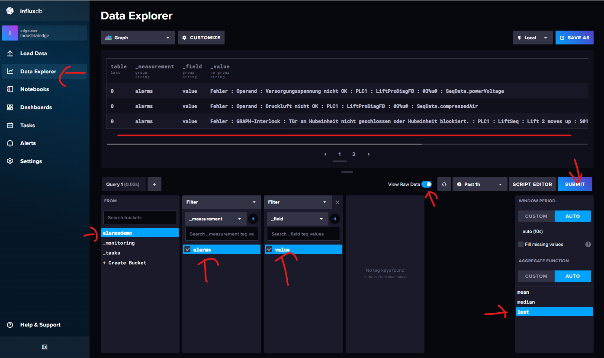

and there is the data in influxdb!
